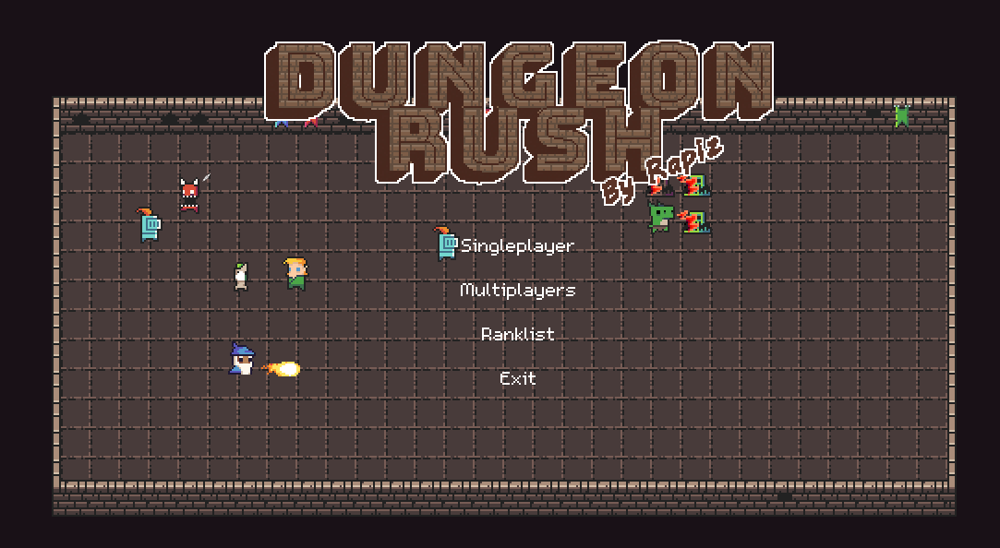

# DungeonRush

> A game inspired by Snake, in pure C++ with SDL2.
> My piece of work. Hope you like it :)

*This fork of the game has been updated to focus exclusively on macOS support.*

The executable is called `dungeon_rush`

## How to Play

### Singleplayer

Use WASD to move.

Collect heros to enlarge your army while defending yourself from the monsters. Each level has a target length of the hero queue. Once it's reached, you will be sent to the next level and start over. There are lots of stuff that will be adjusted according to the level you're on, including factors of HP and damage, duration of Buffs and DeBuffs, the number and strength of monsters and so on.

### Multiplayers
Use WASD and the arrow keys to move.

This mode is competitive. Defend yourself from the monsters and your friend!

### Weapons

There are powerful weapons randomly dropped by the monsters. Different kinds of heros can be equipped with different kind of weapons.

*My favorite is the ThunderStaff. A cool staff that makes your wizard summon thunder striking all enemies around.*

### Buff/DeBuff

There's a possibility that the attack from one with weapon triggers certain Buff on himself or DeBuff on the enemy.

- IceSword can frozen enemies.
- HolySword can give you a shield that absorbs damage and makes you immune to DeBuff.
- GreatBow can increase the damage of all your heros' attack.
- And so on.

For sure, some kinds of monsters have weapons that can put a DeBuff on you! *(Like the troublesome muddy monsters can slow down your movement.)*

## Dependencies

The project requires no more than common SDL2 libraries.
`SDL2, SDL2-image, SDL2-mixer, SDL2-net, SDL2-ttf`

### For MacOS

```sh
brew install sdl2 sdl2_image sdl2_mixer sdl2_net sdl2_ttf
```

## Compilation on macOS

**You should make sure all dependencies are installed before compiling.**

To build and run the game on macOS, use the following commands:
```sh
mkdir -p build && rm -rf build/*
cmake -S . -B build -DCMAKE_C_FLAGS="-DSOFTWARE_ACC"
cmake --build build
./build/bin/dungeon_rush
```

## License and Credits
DungeonRush has mixed media with various licenses. Unfortunately I failed to track them all. In other word, there are many stuff excluding code that comes with unknown license. You should not reuse any of audio, bitmaps, font in this project. If you insist, use at your own risk.

### Code
GPL

### Bitmap
|Name|License|
|----|-------|
|DungeonTilesetII_v1.3 By 0x72|CC 0|
|Other stuff By rapiz|CC BY-NC-SA 4.0|

### Music
|Name|License|
|----|-------|
|Digital_Dream_Azureflux_Remix By Starbox|CC BY-NC-SA 4.0|
|BOMB By Azureflux|CC BY-NC-SA 4.0|
|Unknown BGM|Unknown|
|The Essential Retro Video Game Sound Effects Collection By Juhani Junkala |CC BY 3.0|